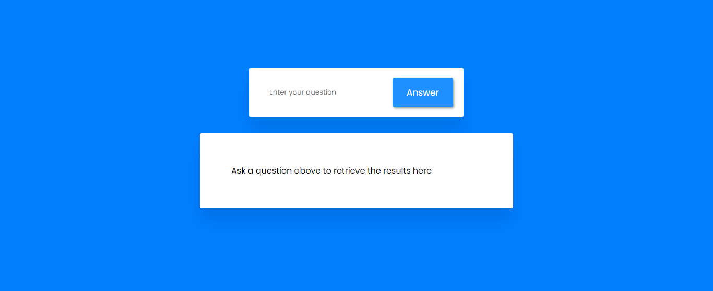
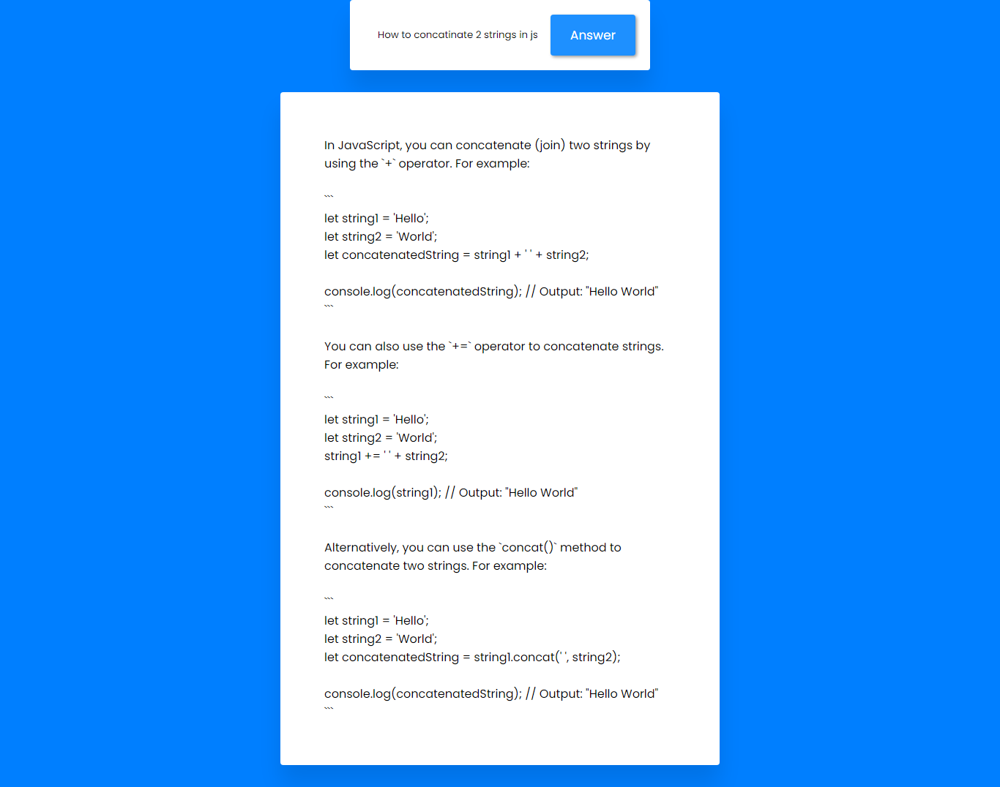

# ChatGPT-Clone

This is a chatGPT clone application which is made using Node.JS, Express and HTML, CSS.
At the Backend it basically uses an npm package called chatGPT which in their backend they are using webscrapping tool called pupeteer to actually login, fetch and provide the data by OPENAI CHATGPT. Thats pretty much how this app works..

## Dependencies of this project

 - [ChatGPT](https://www.npmjs.com/package/chatgpt)
 - [Express](https://www.npmjs.com/package/express)
 - [dotenv](https://www.npmjs.com/package/dotenv)
 - [Nodemon as devDependency](https://www.npmjs.com/package/nodemon)
 - [Pupeteer (Optional)](https://www.npmjs.com/package/pupeteer)


## Clone it

To run this on your local computer just use this 

For Windows

```bash
  git clone git@github.com:cleverhare/chatGPT-Clone.git
```
For MacOS and Linux based distributions
```bash
 sudo git clone git@github.com:cleverhare/chatGPT-Clone.git
```
After that Just run the following
```bash
 npm install
```
Then make a proces.env or alternatively only .env file and save the following code inside 
```bash
 OPENAI_EMAIL=your Open AI email
 OPENAI_PASSWORD=your password
```
Then run the following command in your favortite terminal
```bash
node index.mjs 
```
or alternatively 
```bash
npm run dev
```
which is intended to use for development purpose, and this command in the backend use nodemon as a package
## Environment Variables

To run this project, you will need to add the following environment variables to your .env file

`OPENAI_EMAIL`

`OPENAI_PASSWORD`

Here is the format

```bash
 OPENAI_EMAIL=your Open AI email
 OPENAI_PASSWORD=your password
```
## Features

- You can do anything here which is possible on actual chatGPT


## Tech Stack

**Client:** HTML, CSS, JavaScript

**Server:** NodeJS, ExpressJS, Other modules 


## Screenshots





## Contributing

Contributions are always welcome!

You have to raise an issue for everychange that you want in the application.

You will be assigned if the issue or recomendation found legit and worth adding. 


## FAQ

#### Why We have to solve the capctcha can't this be automated as well 

Yes it can be but for that we have to use services like noceptcha or 2captcha, Stay alert may be this feature is coming soon..


## Thank You

Thank You very much for reading this till the end..

